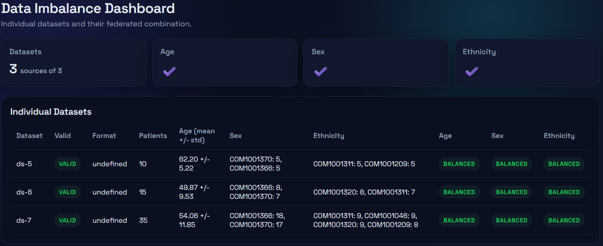
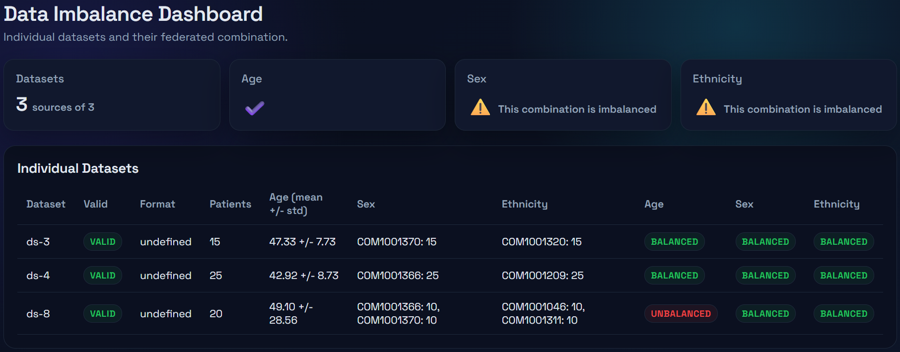
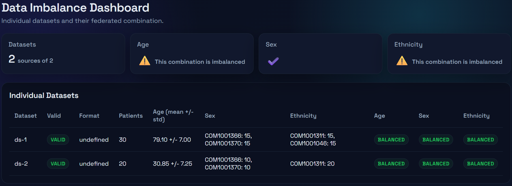

# EUCAIM Federated Datasets Unbalance Checker

### EUCAIM CDM File Structure Overview

> **Note.** The EUCAIM CDM is still not 100% defined. This work makes some assumptions that are not yet set in stone and may change in the future.

Each dataset to be shared within EUCAIM must follow this standardized structure:

#### 1. Source Data File(s)

The primary clinical dataset(s) should be provided in tabular form as `.csv` (comma-separated values), using a dot `.` as the decimal separator and a comma `,` as the list separator.

If there are multiple datasets (e.g., clinical data, imaging metadata), they must be placed in separate directories.

#### 2. Imaging Data

- Raw imaging data must be in DICOM format (mandatory).
- Segmentations must follow DICOM SEG or be linked to a valid source image.
- Imaging metadata (extracted from DICOM headers) is stored in JSON format and mapped to the CDM imaging model.

#### 3. Summary of EUCAIM File Structure

```text
dataset/
├── clinical_mandatory_view.csv      # flat clinical summary (one row per patient)  [mandatory]
├── imaging_mandatory_view.csv       # flat imaging summary (one row per series)     [mandatory]
├── clinical_data/                   # normalized tables                             [mandatory]
│   ├── patient.csv                  #                                               [mandatory]
│   ├── cancer_condition.csv         #                                               [mandatory]
│   ├── procedure.csv                #                                               [mandatory]
│   ├── episode.csv                  #                                               [mandatory]
│   ├── episode_event.csv            #                                               [mandatory]
│   ├── image_study.csv              #                                               [mandatory]
│   ├── image_series.csv             #                                               [mandatory]
│   ├── treatment.csv                #                                               [optional]
│   ├── surgical_procedure.csv       #                                               [optional]
│   ├── radiotherapy.csv             #                                               [optional]
│   ├── image_modality.csv           #                                               [optional]
│   ├── segmentation_series.csv      #                                               [optional]
│   └── segment.csv                  #                                               [optional]
└── imaging_data/
    └── {patient_id}/
        └── {study_uid}/
            └── {series_uid}/
                ├── instance_001.dcm
                └── ...
```

### EUCAIM CDM Example Datasets

The folder `runner/test` contains a script (`generate_datasets.py`) that creates eight synthetic datasets following the EUCAIM CDM and the EUCAIM file structure, as described in the following table:

**Contents of Each Dataset**

| Dataset | # Patients | Age Range | Sex Distribution | Ethnicity                        | Notes                  |
|:--------|:----------:|----------:|:-----------------|:---------------------------------|:-----------------------|
| ds-1    | 30         | 70–90     | Mixed            | African/Caucasian                | Older adult cohort     |
| ds-2    | 20         | 20–40     | Mixed            | Caucasian                        | Young adult cohort     |
| ds-3    | 15         | 30–60     | All Female       | Asian                            | Only Female            |
| ds-4    | 25         | 30–60     | All Male         | Hispanic                         | Only Male              |
| ds-5    | 10         | 40-80     | Mixed            | Caucasian/Hispanic               | ---                    |
| ds-6    | 15         | 30-75     | Mixed            | Asian/Caucasian                  | ---                    |
| ds-7    | 35         | 35-80     | Mixed            | African/Asian/Caucasian/Hispanic | ---                    |
| ds-8    | 20         | 20-80     | Mixed            | African/Caucasian                | Young and older skewed |

### How to use `federated-unbalance-checker`

#### 1. Prepare the Docker Images

First, prepare the local images using the two Dockerfiles included in the `runner` and `aggregator` repositories.

```bash
docker build -f containers/runner/dockerfile -t federated-unbalance-runner containers/runner
docker build -f containers/aggregator/dockerfile -t federated-unbalance-aggregator containers/aggregator
```

Upon successful build, the images are listed as:

```bash
mashtari@compute:~$ docker image ls
REPOSITORY                        TAG         IMAGE ID       CREATED        SIZE
federated-unbalance-aggregator    latest      279aa6b7f285   About an hour ago   211MB
federated-unbalance-runner        latest      3862b5e6ee07   About an hour ago   289MB
```

#### 2. Run the Runner Image

Execute the `runner` over _ds-8_:

```bash
docker run --rm \
  -v $(pwd)/test/example_input:/data:ro \         # mounting data volume (read-only)
  -v $(pwd)/test/example_output:/sandbox \        # mounting sandbox to save output (read and write)
  federated-unbalance-runner python main.py \     # image to run
  -i /data/ds-8 \                                 # path to the input dataset
  -o /sandbox/output-d8.json                      # path to the output file
```

This generates a log such as:

```
2026-06-10 17:28:56,359 - INFO - Running runner on dataset: /data/ds-8
2026-06-10 17:28:56,365 - INFO - Runner output saved to: /sandbox/output-d8.json
```

> **Note:** The `:ro` flag on the first mounted volume (the dataset itself) indicates that the path is read-only for the tool, mimicking the executi  on of a tool using FEM (EUCAIM’s Federated Execution Manager).

You can inspect the contents of `output-d8.json`, which should look like:

```json
{
  "dataset_id": "ds-8",
  "num_patients": 20,
  "age_mean": 49.1,
  "age_std": 28.55631555181335,
  "sex_counts": {
    "COM1001366": 10,
    "COM1001370": 10
  },
  "ethnicity_counts": {
    "COM1001046": 10,
    "COM1001311": 10
  },
  "exitcode": 0,
  "error": null,
  "dataset_type": "ecuaim"
}
```

This first level of output provides basic statistics of the local variables: age, sex, and ethnicity. Note that the demographic values for categorical variables are coded according to the official [EUCAIM schema and hyper-ontology](https://hyperontology.eucaim.cancerimage.eu/). For example, "COM1001370" and "COM1001366" represent Female and Male, respectively.

Now, execute the `runner` again over all datasets.

#### 3. Run the Aggregator Image

Let’s start by running the `aggregator` in an unbiased situation:

```bash
docker run --rm \
  -v $(pwd)/test/example_output:/sandbox \
  federated-unbalance-aggregator \
  -i /sandbox/output-d5.json /sandbox/output-d6.json /sandbox/output-d7.json \
  -o /sandbox/
```

The `aggregator` generates a `.json` file and an `.html` file. The `.json` file contains:

```json
{
  "age_imbalance": false,
  "sex_imbalance": false,
  "ethnicity_imbalance": false,
  "details": {
    "sex": {
      "global_counts": {
        "com1001370": 29,
        "com1001366": 31
      },
      "global_dominant_frac": 0.5166666666666667,
      "degenerate_clients": []
    },
    "ethnicity": {
      "global_counts": {
        "com1001311": 21,
        "com1001209": 13,
        "com1001320": 17,
        "com1001046": 9
      },
      "global_dominant_frac": 0.35,
      "degenerate_clients": []
    }
  },
  "age_diff": 12.333333333333336,
  "number_sets": 3,
  "evaluated_sets": 3
}
```
<!-- 
      "global_counts": {
        "Female": 29,
        "Male": 31

    "ethnicity": {
      "global_counts": {
        "white": 21,
        "hispanic": 13,
        "asian": 17,
        "african": 9 -->

As you can see, the first lines summarize whether these datasets are imbalanced from a federated point of view. The `.html` file provides the same information in a human-readable format:

.

Now let’s run the `aggregator` again in a biased situation:

```bash
docker run --rm \
  -v $(pwd)/test/example_output:/sandbox \
  federated-unbalance-aggregator \
  -i /sandbox/output-d3.json /sandbox/output-d4.json /sandbox/output-d8.json \
  -o /sandbox/
```

The `.html` file will look like the following:

.

The highlights at the top warn about both sex and ethnicity biases from the federated point of view. The dataset detail table then indicates that ds-8 is locally age-biased (while, from the overall federated perspective, age is not biased).

Let’s run the `aggregator` one more time in another biased situation:

```bash
docker run --rm \
  -v $(pwd)/test/example_output:/sandbox \
  federated-unbalance-aggregator \
  -i /sandbox/output-d1.json /sandbox/output-d2.json \
  -o /sandbox/
```

The `.html` file reports both age and ethnicity biases from the federated point of view:

.
